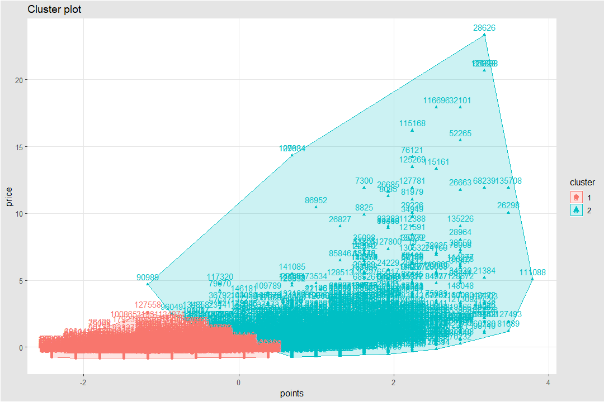

# Veri Madenciliği Ödevi

Eksik olan bazı bilgileri yorum satırına yazdım. Yazdığım scriptin linki: [RSCRİPT](https://gitlab.com/rection/notlar/blob/master/Wine%20Data%20Mining/SonScript.r)

Ödevi sunmaya hazırlandığım pdf dosyası: [odt dosyası](https://gitlab.com/rection/notlar/blob/master/Wine%20Data%20Mining/Wine%20Reviews.pdf)

## K Yakınlık Kümelemesi (K Means Clustering)

K yakınlık kümesi hesaplayacağım. Kullandığım veri seti dünya genelinde şarap tadımı sonucunda çıkan değerlendirmelerde şarap puanlaması, hangi bağdan hasat edildiği, hangi ülkede işlendiği, satılan ülkelerde ki fiyatlandırması, tanımlandırması bulunmaktadır. Benim incelemek istediğim değerler şarapların hangi ülkede üretildiği, şarap puanlaması, şarap fiyatlandırması ve hangi üzüm çeşidi ile yapıldığını incelemektir.Sonuç olarak çıkmasını beklediğim en kaliteli şaraplar genellikle nerede üretildiğini bulmak, şarap fiyatları ile şarap kalitesinin k yakınlık kümesinde sınıflandırmak, üretim yapılan ülkeler ile puanlamanın grafik üzerinde gösterimidir.

Veri setini kaggle'dan edindim.

[Bağlantı :](https://www.kaggle.com/zynicide/wine-reviews)

Veri setinde 150 bin satırlık olanı seçtim. Kod aşamasına geçersek;

Çalışma dizinini default olarak değiştirmek için:

```
setwd("/media/safa/FAF09CCAF09C8F0F/Users/SAFA/Downloads/Dataset")
```

Veri setinin okunmasını sağlamak için:

```
asil <- read.csv('winemag-data_first150k.csv')
```

Gerekli olan paketleri yüklemek için:

`````
install.packages("tidyverse")
install.packages("cluster")
install.packages("factoextra")
install.packages(“ggthemes”)
`````

Linux üzerinde çalıştığım için bazı dizinlere erişimekte sorun yaşadığımdan üstteki paketleri şu şekilde yükledim:

````````
install.packages("cluster", dependencies=TRUE, INSTALL_opts = c('--no-lock'))
install.packages("tidyverse", dependencies=TRUE, INSTALL_opts = c('--no-lock'))
install.packages("factoextra", dependencies=TRUE, INSTALL_opts = c('--no-lock'))
install.packages("ggthemes", dependencies=TRUE, INSTALL_opts = c('--no-lock'))
````````

Sonrasında incelemeyeceğim satırları setten çıkarttım:

```````
 asil[1] <- NULL
 asil[2] <- NULL
 asil[2] <- NULL
 asil[4] <- NULL
 asil[5] <- NULL
 asil[6] <- NULL
```````

Veri setinde istediğimiz şekilde yapılandırdım. Şimdi K means clustering (K yakınlık kümesi)’i nasıl yapacağımıza geçelim.

## K-means Clustering:

Verilen benzer küme gözlemlerine bölünmesini sağlar. Küme gözlemlerinden demek istediğim, Verilerin benzer özelliklerine göre sınıflandırıp ve hangi sınıflandırmada olduğunu incelemek için kullanılır. Benzerlik dışında kalan verilerin belli bir küme içerisine girene kadar işlem tekrarlanması gerekir. Eğer yapılmaz ise sonuçlar kesin olmayabilir. Önemli faktörlerden birisi sınıflandırmanın nelere göre yapılacağıdır. Sınflandırmalar, belli bir veri kümesinin diğer verilere uzaklığı alınarak bulunur. Uzaklığı bulmak için derste gördüğümüz gibi çok fazla yakınlık hesaplamak için algoritma vardır. Bunlardan Öklit uzaklık hesaplama tekniği en popüleri ve kullanışlısıdır.

R’ın base repository’sinde bulunan kmeans() fonksiyonu ile kümeleme işlemi yapılabilir. K means clustering’ın büyük problemlerinde birisi k değerinin belirlenmesidir. K değeri kaç tane küme olacağını göstermektedir. Bunun belirlenmesi için tahmini bir değer atanabilir, veri sütününun ortalamasına yakın değer kullanılabilir, rastgele sayılar denenerek bulunabilir.

Fonksiyonun parametreleri şöyledir:

`````
kmeans(x, centers, iter.max=10, nstart=1)
`````

**x :** data frame, matrix veya vector olabilir.
**centers :** Küme sayısı değeri veya başlangıç küme merkezlerinin değerleri
**iter.max :** maximum iterasyon sayısı
**nstart :** Centers sayı ise rastgele başlangıç küme sayısı. 1 veya 1’den büyük değer olmalıdır.

Kmeans fonksiyonu çıktı olarak şunları verir:

**cluster :** Bir tamsayı vektörü (1:k) gözlemleri atandağı kümeleri belirler
**centers :** Küme merkezlerinin (küme ortalamalarının) matrixi
**totss :** Toplam kareler toplamı (TSS), TSS verisetindeki toplam varyasyonu belirler.
**withinss :** Küme içi kareler toplamı, her küme için bir sayı
**tot.withinss :** Toplam kümeiçi kareler toplamı
**betweenss :** Kümelerarası kareler toplamı
**size :** Her kümedeki gözlem sayısı

Bunun yanında ``` set.seed() ``` kullanılmalıdır. Nedeni random sayı üretirken testlerin tutarlı sonuç vermesini sağlar.

`````

> summary(asil)
      country          points           price
 US       :62397   Min.   : 80.00   Min.   :   4.00
 Italy    :23478   1st Qu.: 86.00   1st Qu.:  16.00
 France   :21098   Median : 88.00   Median :  24.00
 Spain    : 8268   Mean   : 87.89   Mean   :  33.13
 Chile    : 5816   3rd Qu.: 90.00   3rd Qu.:  40.00
 Argentina: 5631   Max.   :100.00   Max.   :2300.00
 (Other)  :24242                    NA's   :13695

         region_1                          variety
                     : 25060   Chardonnay              :14482
 Napa Valley         :  6209   Pinot Noir              :14291
 Columbia Valley (WA):  4975   Cabernet Sauvignon      :12800
 Mendoza             :  3586   Red Blend               :10062
 Russian River Valley:  3571   Bordeaux-style Red Blend: 7347
 California          :  3462   Sauvignon Blanc         : 6320
 (Other)             :104067   (Other)                 :85628

`````

Görüldüğü gibi değerler arasında çok fazla fark vardır.  Bunun için normalizasyon işllemi yapmalıyız. Bunun sonucunda veriler daha verimli biçimde kullanabileceğiz.

````
> df <- na.omit(asil) # NA, NULL veya anlamsız bulunan verilerin çıkarılma işlemini yapar.
> df$points <- scale(df$points) # Scale standartlaştırma işlemi yapılmaktadır.
> df$price <- scale(df$price)	 # Veri seti içinde string olduğu için ayrı oldu.
````

Küme sayısının belirlenmesinden bahsetmiştim. Sonradan bulduğum bir kütüphane aracılığıyla belirlenmesinde yardımcı olmaktadır.
Kütüphaneyi aktif etmek için:

```  
library(factoextra)
```

Random atanacak sayının stabil olması için:

```
set.seed(123)
```

Normal durumlar için bu fonksiyon ile bulunabilir.

```
fviz_nbclust(df, kmeans, method=”wss”)
```

Şöyle bir hatayla karşılaşıyorum.

```
Error: cannot allocate vector of size 70.2 Gb
```

Bu yüzden veri setinin verimli şekilde küçültmek alternatif yollardan birisidir. Bunu yapmak için 137 bin satırdan rastgele değerler seçilip bunlar üzerinden değerleri işlemek daha hızlı olup, RAM miktarının yeterli miktarda olmasını da sağlar. Rastgele satırlar seçip yeniden df1 adında bir datasetine tanımlamaktadır:

````
df1 <- df[sample(nrow(df), 20000), ]
````

Veri setinden rastgele 20 bin satır seçip df1 adında değişkene atanmaktadır. Sonrasında fviz_nbcluse fonksiyonuna  koyabiliriz. ‘df1’ değişkenin satırlarından sayısal değer bulunanları seçilmesi için 2. ve 3. satırlarının seçilmesi gerekir. Nedeni diğer satırların string’ten oluşmaktadır. Hesaplaması 20 dakika civarı sürdü.

````
fviz_nbclust(df1[,2:3], kmeans, method = 'wss')
````

Sonuc olarak:


Tabloda en fazla kırılma olan yer k değerinin en verimli olduğu değerdir. Bunun için k değeri tahmini olarak 2 veya 5 olacağını göstermektedir. Bu yüzden k=2 ve k=5 değerleri için karşılaştırma yapmalıyız.

Rastgele değerlerin seçiminin doğru olması için:

```
set.seed(123)
```

km.res adında ki değişkene k yakınlık hesaplaması yapması için kmeans fonksiyonunu kullandık. Fonksiyon, veri setinin işlenecek veri sütünlarını, k değeri, ve hangi değerden başlayacağını belitmektedir.  Kmeans fonksiyonunu kullanarak k yakınlık tablosunu aktarmakta ve değişkenin içeriği bastırılmaktadır.

```
km.res<-kmeans(df2[2:3], 2, nstart=25)
```

```
print(km.res)
```

K yakınlık kümelendirmesi, Principal Component Analysis(PCA) gibi sınıflarndırma yapar. PCA, 4 tane değişkenin ve çıktıların iki tane yeni değişken olarak verilmesidir. Burada ilk verilerin işlenmiş halini çıktı olarak vermektedir. Plotların kullanımı gibidir.

Diğer tarafından, eğer iki boyutlu bir veri seti var ise bunun bir çözümü PCA’dır ve ilk 2 tane esasa uyarak elemanların toplandığı kordinatlar olmaktadır. Benim kullandığım veri setinde de 2 boyutlu olarak değerlendirilebilir. Çünkü sadece puanlandırma ve fiyat arasında ki ilişkiye bakarak. Şarapların sınıflandırmasına bakılmaktadır.
Son olarak k=2 değerinin grafik haline geçmesi için fviz_cluster fonksiyonunu kullandım. ‘km_res’ değeri kmeans fonksiyonun k yakınlık değerlerini tutan değişkendi.

```
fviz_cluster(km.res, data=df)+ tma
```

Sonucunda:



Grafikte görüldüğü gibi k=2 durumu için pek doğru bir sınıflandırma olmamaktadır. Sadece iki kalite de şarap bulunduğunu ifade eden bir grafiktir. K=5 değerini denemeliyiz ve hangi grafiğin daha doğru olduğuna karar vermeliyiz.


```
km.res<-kmeans(df2[2:3], 5, nstart=25)
fviz_cluster(km.res, data=df)+ tma
```

Sonucunda :


İşaretlenmiş verileri kümesi şarapların fiyatlandırma ve puanlama kategorisine alarak hem uygun fiyatlı hem de kaliteli şarapları sınıflandırmaktadır. İşaretlenmiş sayılar şarapın bulunduğu satırı işaret etmektedir. Clusterların sınıfı ise:

- **Yeşil bölge :** Ücret olarak düşük ve kalite olarak da düşük sınıftır.
- **Kırmız bölge :** Fiyatları düşük puanlarla aynı fakat kalite olarak daha üstündür.
- **Mavi bölge :** Fiyatların artmasıyla kaliteli ve kalitesiz karışık durmaktadır. Bu sınıf için veriler tam isabetli değildir. İndeks sayılarına göre bakılıp karşılaştırılmalıdır.
- **Mor bölge :** Fiyatların ve kaliteli şarapların olduğu sınıftır.

Grafikten çıkarılması gerekenler ise:

- Çok kaliteli şarapların ucuz fiyata satılabildiğini,
- Ucuz şarapların kalitesiz olduğu algısının aslında yanlış olduğu,
- Şarapların kalitesinin ve fiyatlarında sınıflandırmasının düşük kaliteli şaraplarda daha başarılı olduğu ortaya çıkmaktadır.


Dünyada en fazla üretim yapan ülkeleri pasta grafiğinde göstermek için satırlarda bulunan bilgileri kullanıp arraylere atadım.

```````
t2=c('US','Italy','France','Spain','Chile','Argentine','Other') 	# Ülkeri karakter dizisine aldım.
t3=c(62139,18784,14785,8160,5766,5587,22014)		# 150 bin değer üzerinden bulunan değer alıp karakter dizisine atadım.
pct <- round(t3/sum(t3)*100)	# pct değişkenine yüzde değerlerini alabilmek için, her değerin toplamının 100 ile çarpımına böldüm.
lbls <- paste(t2, pct)  # Ülkelerin isimleriyle pct değerlerini eşleştirdim.
lbls <- paste(lbls,"%",sep="")     # Her değerin başına yüzde işareti ve boşluksuz yazılmasını sağladım.
pie(t3,labels = lbls, col=rainbow(length(lbls)),
+     main="Ülkelerin şarap üretimi")	# Pie fonksiyonu ile t3 sayısal değerlerini ve isimlendirme olarak da önceden birleştirdiğim yüzde ifadeleriyle ülkeri yerleştirdim. Renklendirme için col parametresini kullandım. Rainbow gök kuşağı renklerini ifade etmektedir. İsimlendirme olarak grafiğin başına yazılması içinde main parametresini kullandım.
```````

Grafikten görüldüğü üzere dünya genelinde en fazla üretim yapan ülke %45 ile amerika gözükmektedir.


Son karşılaştırma olarak 150 bin tadım yapılmış üzümlerin puanlandırması ve ülkelere göre karşılaştırmasını yaptım.
````
qplot(data$country,data$points,data=data,geom=c("boxplot", "jitter"),xlab = "Ülkeler",ylab = "Şarap Puanlaması",main = "Şarap puanlaması ve üretildiği ülkeler") + theme(axis.title=element_text(face="bold", size="24",color="red"), legend.position="top")
````
qplot fonksiyonunu kullanmak için ggplot2 yi aktif etmeniz gerekmektedir. Kod zaten yeterince açıklayıcıdır. Burada R programlama dilinin becerisini göstermektedir. Bir insanın hayatı boyunca işleyemeyeceği boyutta veriyi 10 dakika içerisinde hatasız olarak vermektedir.


