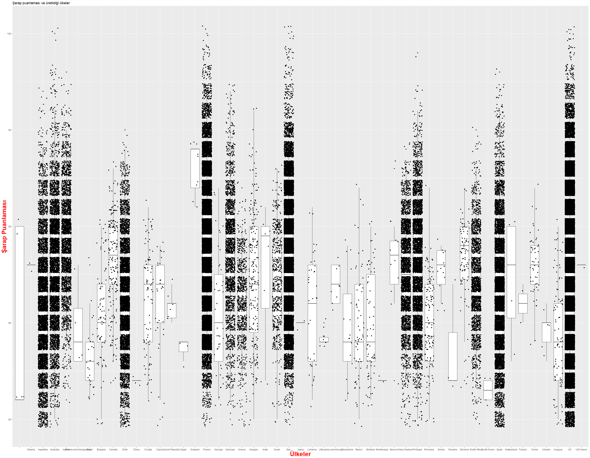
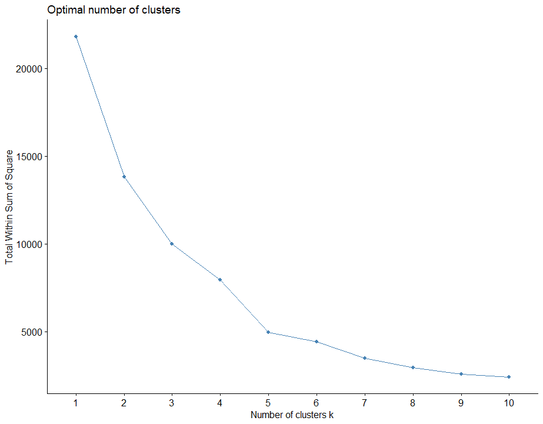
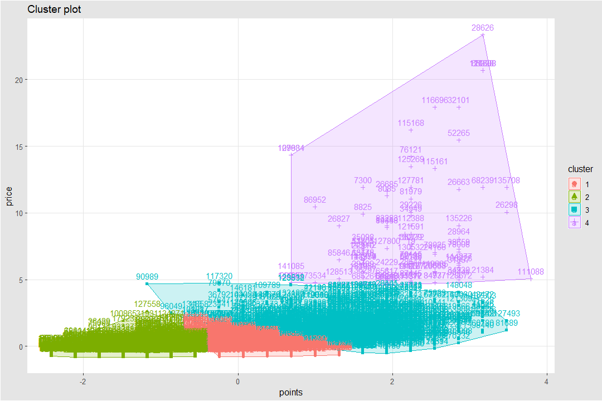
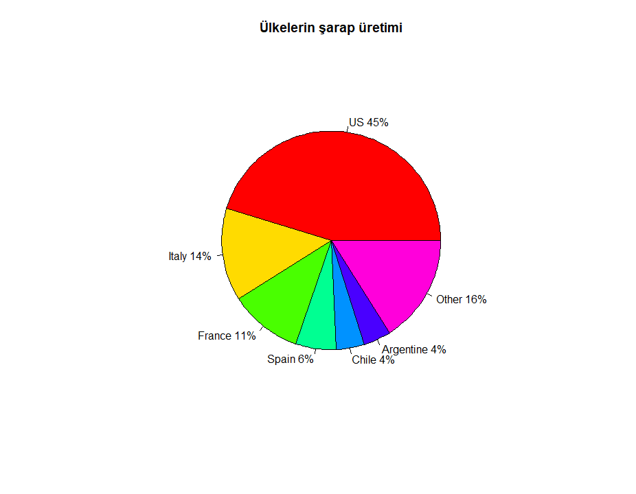

# Data Mining Assignment



I wrote some missing information on the comment line. Link to the script I wrote: [RSCRIPT](https://gitlab.com/rection/notlar/blob/master/Wine%20Data%20Mining/SonScript.r)

The pdf file I prepared to present the homework: [odt file](https://gitlab.com/rection/notlar/blob/master/Wine%20Data%20Mining/Wine%20Reviews.pdf)

## K Proximity Cluster (K ​​Means Clustering)

I will calculate the K proximity set. The data set I use is based on wine tastings in the world, and the wine scoring, which vineyard is harvested, which country it is processed in, the pricing and definition in the countries sold. The values ​​I want to examine are to examine in which country the wines are produced, wine scoring, wine pricing and what type of grapes are produced. As a result, the best wines that I expect to come out to find are where they are usually produced, to classify the wine prices and the wine quality in the k proximity set, the chart with the countries that are produced, graphics is on the representation.

I got the dataset from kaggle.

[Link:](https://www.kaggle.com/zynicide/wine-reviews)

I selected 150 thousand lines in the data set. Moving to the code stage;

To change the working directory to default:

```
setwd ( "/ media / pure / FAF09CCAF09C8F0F / Users / SAFA / downloads / Dataset")
```

To ensure that the data set is read:

```
noble <- read.csv ('winemag-data_first150k.csv')
```

To install the required packages:

`````
install.packages ( "If tidyv")
install.packages ( "cluster")
install.packages ( "factoextr A")
install.packages ( "ggthemes")
`````

Since I have problems accessing some directories because I work on Linux, I installed the above packages as follows:

````````
install.packages ("cluster", dependencies = TRUE, INSTALL_opts = c ('- no-lock'))
install.packages ("tidyverse", dependencies = TRUE, INSTALL_opts = c ('- no-lock'))
install.packages ("factoextra", dependencies = TRUE, INSTALL_opts = c ('- no-lock'))
install.packages ("ggthemes", dependencies = TRUE, INSTALL_opts = c ('- no-lock'))
````````

Then I removed the lines that I wouldn't review:

```````
 noble [1] <- NULL
 noble [2] <- NULL
 noble [2] <- NULL
 noble [4] <- NULL
 noble [5] <- NULL
 noble [6] <- NULL
```````

I configured it as we wanted in the dataset. Now let's move on to how to do K means clustering.

## K-means Clustering:

It allows dividing into given similar cluster observations. What I mean by cluster observations is used to classify the Data according to similar characteristics and to examine which classification it is in. The process should be repeated until the data outside of the similarity enters a certain cluster. If not, the results may not be accurate. One of the important factors is what the classification will be made according to. Classifications are found by taking the distance of a particular data set from other data. As we have seen in the lesson to find the distance, there is an algorithm for calculating too much affinity. Euclidean distance calculation technique is the most popular and useful.

Clustering can be done with the kmeans () function located in the base repository of R. One of the major problems of K means clustering is the determination of the k value. The K value indicates how many clusters there will be. To determine this, an estimated value can be assigned, the value close to the average of the data column can be used, and random numbers can be found by trying.

The parameters of the function are as follows:

`````
kmeans (x, centers, iter.max = 10, nstart = 1)
`````

**x:** data frame can be matrix or vector.
**centers:** Cluster number value or initial cluster center values
**iter.max:** maximum number of iterations
**nstart:** Centers number is the random start set number. Must be greater than 1 or 1.

The Kmeans function outputs the following:

**cluster:** An integer vector (1: k) observations determine the assignment sets
**centers:** Matrix of cluster centers (cluster averages)
**totss:** Total sum of squares (TSS) determines the total variation in the TSS database.
**withinss:** Sum of intra-cluster squares, one number for each cluster
**tot.withinss:** Total sum of intra-cluster squares
**betweenss:** sum of inter-cluster squares
**size:** Number of observations in each cluster

In addition, '' set.seed () '' should be used. The reason is that when generating random numbers, the tests provide consistent results.

`````

> summary (noble)
      country points price
 US: 62397 Min. : 80.00 Min. : 4.00
 Italy: 23478 1st Qu .: 86.00 1st Qu .: 16.00
 France: 21098 Median: 88.00 Median: 24.00
 Spain: 8268 Mean: 87.89 Mean: 33.13
 Chile: 5816 3rd Qu .: 90.00 3rd Qu .: 40.00
 Argentina: 5631 Max. : 100.00 Max. : 2300.00
 (Other): 24242 NA's: 13695

         region_1 variety
                     : 25060 Chardonnay: 14482
 Napa Valley: 6209 Pinot Noir: 14291
 Columbia Valley (WA): 4975 Cabernet Sauvignon: 12800
 Mendoza: 3586 Red Blend: 10062
 Russian River Valley: 3571 Bordeaux-style Red Blend: 7347
 California: 3462 Sauvignon Blanc: 6320
 (Other): 104067 (Other): 85628

`````

As can be seen, there is a huge difference between values. For this we need to do normalization. As a result, we will be able to use the data more efficiently.

````
> df <- na.omit (noble) # NA extracts data that is NULL or meaningless.
> df $ points <- scale (df $ points) # Scale standardization is done.
> df $ price <- scale (df $ price) # Separate because there is a string in the data set.
````

I mentioned the determination of the number of clusters. It helps in identifying through a library that I found later.
To activate the library:

```
library (factoextr A)
```

In order for the number to be assigned randomly to be stable:

```
set.seed (123)
```

It can be found with this function for normal situations.

```
fviz_nbclust (df, kmeans, method = ”wss”)
```

I encounter an error like this.

```
Error: cannot allocate vector of size 70.2 Gb
```

Therefore, shrinking the data set efficiently is one of the alternative ways. To do this, it is faster to select random values ​​from 137 thousand rows and to process the values ​​over them, and it also provides sufficient amount of RAM. It selects random lines and redefines it to a dataset called df1:

````
df1 <- df [sample (nrow (df), 20000),]
````

20 thousand rows are randomly selected from the data set and assigned to the variable named df1. Then we can put it into fviz_nbcluse function. In order to select the numerical value from the lines of variable 'df1', lines 2 and 3 must be selected. The reason is the string of other lines. It took about 20 minutes to calculate.

````
fviz_nbclust (df1 [, 2: 3], kmeans, method = 'wss')
````

As a result:



The place where the k value is the most broken in the table is the most efficient value. For this, the value of k indicates that it will be an estimated 2 or 5. So we have to compare for k = 2 and k = 5.

For the selection of random values ​​to be correct:

```
set.seed (123)
```

We used the kmeans function to calculate k proximity to the variable named km.res. The function specifies the data columns to be processed, the k value, and from which value the data set will start. Using the Kmeans function, it transmits the k proximity table and the content of the variable is suppressed.

```
km.res <-kmeans (df2 [2: 3], 2, nstart = 25)
```

```
print (km.res)
```

K affinity clustering classifies such as Principal Component Analysis (PCA). PCA is to give 4 variables and outputs as two new variables. Here, it gives the first data processed as output. It is like the use of plots.

On the other hand, if there is a two-dimensional data set, a solution for this is PCA and the coordinates where the elements are collected by following the first 2 principles. It can also be evaluated in 2D in the data set that I use. Because just by looking at the relationship between scoring and price. The classification of wines is considered.
Finally, I used the fviz_cluster function to convert the k = 2 value into a graph. The 'km_res' value was the variable that kept the k proximity values ​​of the kmeans function.

```
fviz_cluster (km.res, data = df) + tma
```

In Conclusion:


As seen in the graph, there is not much correct classification for k = 2 situation. It is a graphic that states that there are only two quality wines. We have to try K = 5 and decide which chart is more accurate.


```
km.res <-kmeans (df2 [2: 3], 5, nstart = 25)
fviz_cluster (km.res, data = df) + tma
```

As a result:



It sets the marked data in the pricing and scoring category of wines and classifies both affordable and quality wines. The marked numbers indicate the line with the wine. If the class of clusters is:

- **Green zone:** Low in price and low in quality.
- **Red zone:** Prices are the same as low scores but higher in quality.
- **Blue zone:** Quality and poor quality are mixed with increasing prices. Data for this class is not accurate. It should be checked and compared according to the index numbers.
- **Purple region:** This is the class with prices and fine wines.

What needs to be removed from the chart:

- High quality wines can be sold at cheap prices,
- The perception that cheap wines are of poor quality is actually wrong,
- The quality and price classification of wines turns out to be more successful in low quality wines.


I used the information in the lines and assigned them to the arrays to show the countries producing the most in the world in the pie chart.

``````
t2 = c ('US', 'Italy', 'France', 'Spain', 'Chile', 'Argentine', 'Other') # I put the country in the string.
t3 = c (62139,18784,14785,8160,5766,5587,22014) # I took the value from 150 thousand values ​​and assigned it to the string.
pct <- round (t3 / sum (t3) * 100) # To get the percent values ​​to the pct variable, I divide the sum of each value by 100.
lbls <- paste (t2, pct) # I have matched the names of countries with the values ​​of pct.
lbls <- paste (lbls, "%", sep = "") # I have written a percent sign and no spaces in front of each value.
pie (t3, labels = lbls, col = rainbow (length (lbls))),
+ main = "Wine production of countries") # I placed the country with the function of pie with the t3 numerical values ​​and the percentage expressions that I previously combined as naming. I used the parameter col for coloring. Refers to rainbow rainbow colors. As naming, I used the main parameter in the beginning of the chart.
``````

As can be seen from the chart, the country that produces the most in the world is America with 45%.



As a last comparison, I have scored 150 thousand tasting grapes and compared them by country.
````
qplot (data $ country, data $ points, data = data, geom = c ("boxplot", "jitter"), xlab = "Countries", ylab = "Wine Scoring", main = "Wine scoring and countries of production") + theme (axis.title = element_text (face = "bold", size = "24", color = "red"), legend.position = "top")
````
To use the qplot function, you need to activate ggplot2. The code is already descriptive enough. Here R shows the skill of the programming language. It provides the data that a person cannot process throughout his life within 10 minutes without any errors.
