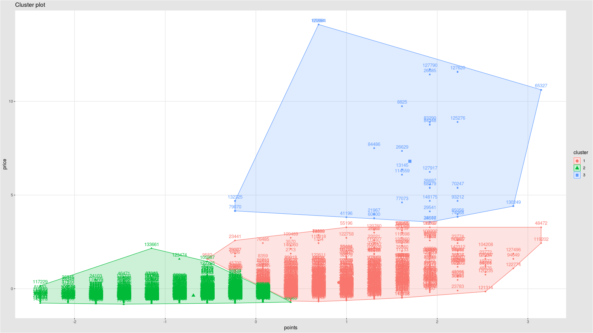

# K Çaprazlama Yöntemiyle Performans Değerlendirme Yöntemi:


Test aşamasında farklılık olarak wine veri seti üzerinden 3000 satırlık bir veri seti oluşturup kullandım. Nedeni ram yetersizliği VPS sunucu kiralayıp 20 GB'lık swap alanı atayıp yaptım. Fakat işlem uzun sürdüğü için bir süre sonra ram ayrılamadı hatası vermektedir.




1.sınıf şarap için doğruluk tablosu:

```
l = df$points >= 0 & df$price >5
summary(l) # puanlandırma 0'dan büyük ve fiyatlandırma 5'ten büyük olacaklardır.

summary(l)
V1
Mode :logical
FALSE:2982
TRUE :18
```

Toplam 3 bin tane rastgele satıdan birinci kalite şaraplaın satır sayılarını buldu.


```
summary(asil)
```

Sonucu minimum 80 maximum 100 puanlandırma açısından miktarıdır.

Fiyat açısından minimum 4.00 maximum 2300.00 sayılarıdır.

```
parca <- 20/3                                                 # Fiyatlandırmayı tablonun birinci kısmını parçalıyoruz.

firstpiece <- 100-parca
secondpiece <- firstpiece - parca
thirdpiece <- secondpiece - parca

l1 <- asil$points < firstpiece & asil$points > secondpiece    # Birinci kaite şarapların tabloda bulunduğu yeri işaret eder.
summary(l1)                                                   # Tabloda bulunan kısımların özeti yani bulunan eşleşmeyi aktarmaktadır.
Mode   FALSE    TRUE
logical   57624   93306
```

```
> 57624/93306       # 150 bin satırın bulunduğu veri setinden alınan doğru yanlış sayısı.
[1] 0.6175809       # Bütün veri setinin, 1. sınıf şarap kısmının testi.
> 2982/18
[1] 165.6667
> 18/2982
[1] 0.006036217     # Parçalanmış 3000 satırlık  veri setinin, 1. sınıf doğruluk oranı
```

Dogruluk orani **0.6175809 / 0.006036217**

```
FirstClassWineAccuracyRatio <- 0.006036217/0.6175809
FirstClassWineAccuracyRatio

 [1] 0.00977397
```

Buradan anlaşılan k yakınlık kümesinde 0.00977397 bir hata ile buldu. Tablo oluşturulur isek;

TP =  0.6175809

TN = 0.006036217

FP = 1-0.6175809 = 0.3824191

FN = 1-0.006036217 = 0.9939638


|        |         | Pozitif   | Negatif     | Toplam   |
|--------|---------|-----------|-------------|----------|
|        | Pozitif | 0.6175809 | 0.006036217 | tpozitif |
| Tahmin | Negatif | 0.3824191 | 0.9939638   | tnegatif |
|        | Toplam  | gpozitif  | gnegatif    | m        |


Sonrasında 2. sınıf ve 3.sınıf kümelemelerine de bakılmalıdır. Önceki yapılan işlem sadece 1.sınıf kalitede ki şarapların doğruluk tablosunu göstermektedir. Önceki işlemler de 0.00977397 yakın değer bulunmaktadır.

df$points > 0 & df$price < 5 *için* asil$points < secondpiece & asil$points > firstpiece  

df$points < 0 & df$price < 5 *için* asil$points < secondpiece & asil$points > thirdpiece  
